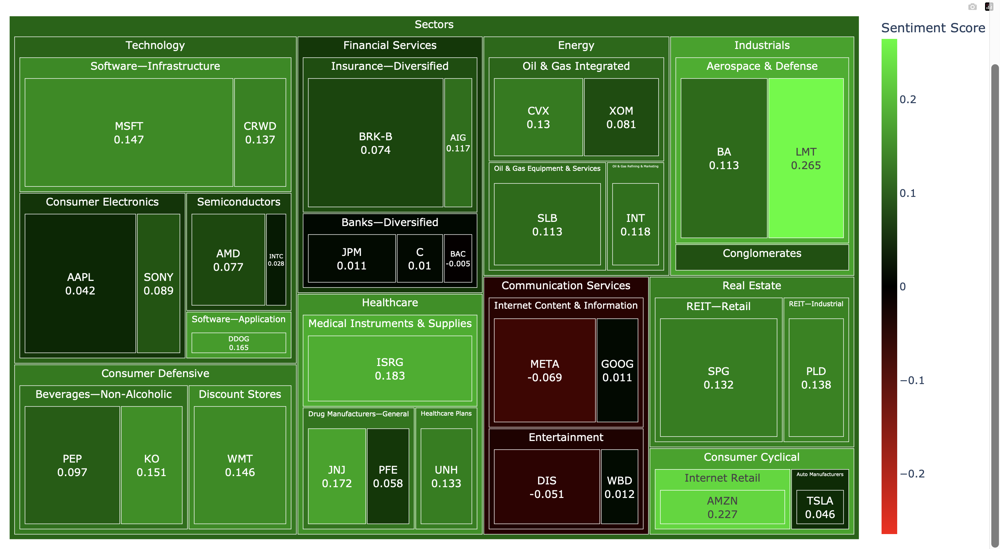

# Stock Market Live Sentiment Dashboard

## Table of Contents
- [Project Overview](#project-overview)
- [Data Source](#data-source)
- [Website Link](#website-link)
- [Implementation Details](#implementation-details)
    - [Methods Used](#methods-used)
    - [Python Packages Used](#python-packages-used)
- [Steps Followed](#steps-followed)
- [Future Improvements](#future-improvements)

  
## Project Overview
Picture this: you're an ambitious investor or a passionate stock enthusiast, eagerly keeping an eye on the ever-changing world of stocks. You want to make informed decisions about your portfolio, but it can be overwhelming to sift through an avalanche of data and news articles. That's where our exciting project comes into play!

This project focuses on generating an interactive stock sentiment treemap for a portfolio of stocks, helping you make informed decisions.

## Data Source
This project involves scraping a real-time dataset of stock news, which is updated every 30 minutes, from [FinViz](https://finviz.com), a well-known website for stock screening.

To gather additional information about the stocks, including the Last Closing Price, sector, and industry name, Python is used along with the yfinance library. This library provides the necessary tools and functionalities to retrieve stock data from various sources.

## Website Link

A web-based demonstration of the live stock market sentiment can be accessed from this [link](https://salonijhalani.github.io/live_sentiment.html).

## Implementation Details

### Methods Used
* Data Collection
* Sentiment Analysis
* Data Visualisation

### Python Packages Used
* Pandas
* nltk
* plotly
* yfinance
* BeautifulSoup

## Steps Followed

1. Data Collection: The project collects stock news from FinViz and retrieves stock information using the yfinance library in Python.
2. Sentiment Analysis: The collected stock news undergoes sentiment analysis using the Vader sentiment analysis tool. This analysis helps determine the sentiment associated with each news article, whether positive, negative, or neutral.
3. Data Visualization: The project utilizes the plotly library to generate data visualizations. These visualizations present the analyzed stock sentiment data in an easily understandable and visually appealing format.
4. Deployment: The project is deployed using GitHub Actions and Pages. This allows for the creation of a live Stock Sentiment Dashboard, which can be accessed and viewed online.
   
## Future Improvements

Here are some potential areas for future improvements in the project:

* Develop a real-time sentiment dashboard for stock market indexes such as Dow Jones and Nasdaq where user can select the index and corresponding information will be displayed.
* Allow users to select specific indexes, including international ones like India, France, UK, and Japan.
* As FinViz doesn't not provide frequent news updates for international stocks, an alternative news source needs to be identified.
